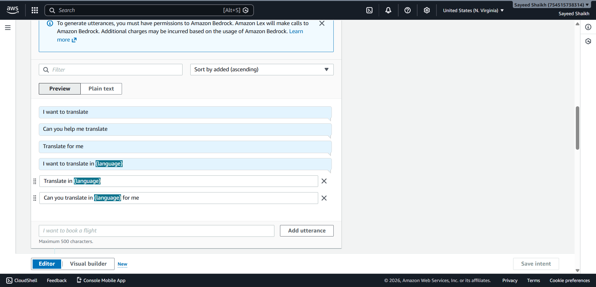
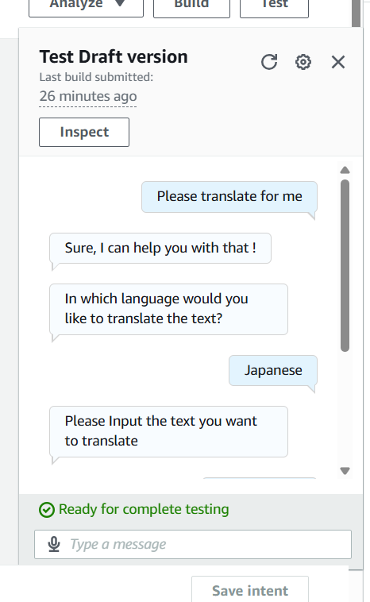
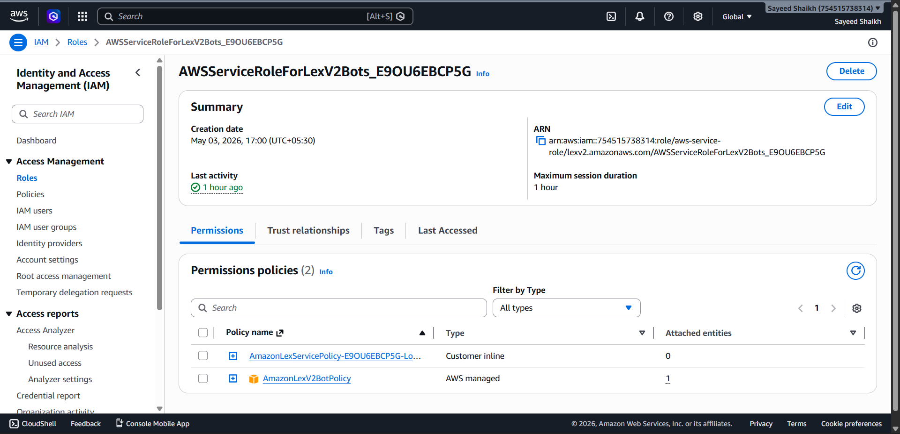
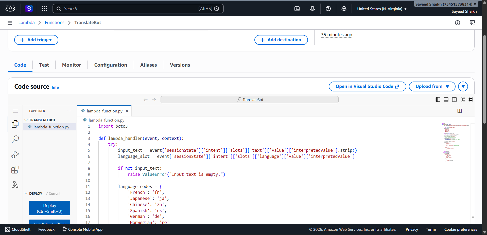

# Language Translation Bot using Amazon Lex + AWS Lambda + Amazon Translate

A chatbot that translates text into multiple languages (French, Japanese, Chinese, Spanish, German, Norwegian) using AWS AI services.

## 📸 Proof of Work

### Step 1: Lex Bot - Intents & Slots

### Step 2: Lambda Function Code

### Step 3: Lambda Test Success

### Step 4: Full Chatbot Conversation

## 🛠️ Services Used
- **Amazon Lex** – conversation flow, intents & slots
- **AWS Lambda** – backend translation logic (Python)
- **Amazon Translate** – AI-powered translation
- **AWS IAM** – secure permissions

## 📁 Project Structure

## ⚙️ How It Works
1. User provides text and target language to Lex bot
2. Lex invokes Lambda function with the input
3. Lambda calls Amazon Translate API (auto-detects source language)
4. Translated text returns to user via Lex

## 🔧 Lambda Code
See [`lambda/lambda_function.py`](lambda/lambda_function.py) for the complete translation function.

## ⏱️ Time & Cost
- **Build time:** ~1.5 hours
- **Cost:** Free (AWS Free Tier eligible)

## 👨‍💻 Author
Sayeed Shaikh
